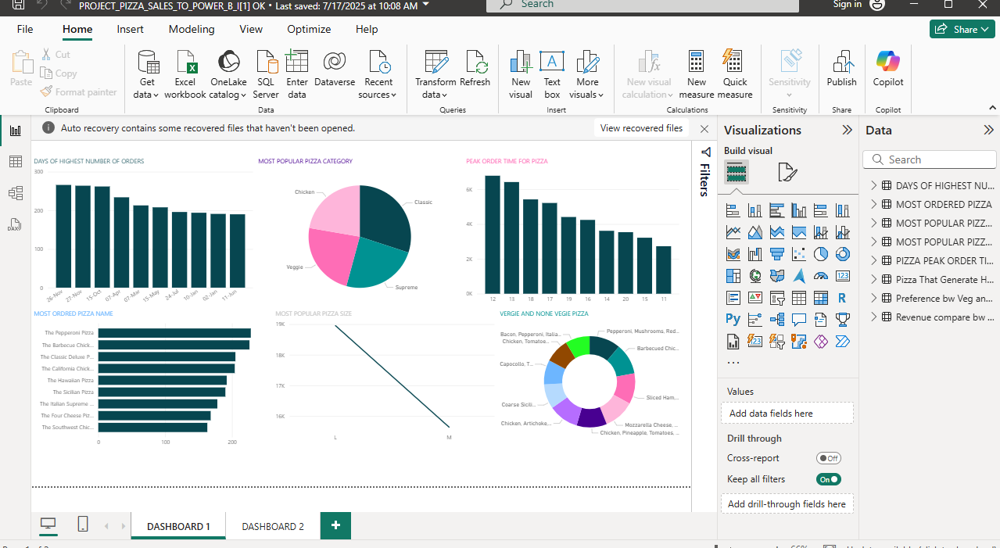

# 🍕 Pizza Sales Dashboard - Power BI Analysis

This project presents an interactive Power BI dashboard that analyzes pizza sales to uncover actionable insights for business optimization. It answers key questions like peak sales times, most popular products, and customer preferences.

---

## 📸 Dashboard Screenshot

---

## 📊 Dashboard Insights

This Power BI report is split across two dashboards (`Dashboard 1` and `Dashboard 2`) with visuals that answer important business questions such as:

- **🗓️ Days with Highest Number of Orders**  
  Discover peak order days for scheduling and promotions.

- **🍕 Most Ordered Pizza Name**  
  Analyze the most popular pizzas by total order count.

- **🍽️ Most Popular Pizza Category**  
  Comparison between Classic, Veggie, and Supreme pizzas.

- **⏰ Peak Order Time**  
  Identify high-demand hours for kitchen planning.

- **📏 Pizza Size Preference**  
  Understand whether Medium or Large sizes are more popular.

- **🥦 Vegetarian vs Non-Vegetarian Preferences**  
  Visual breakdown of customer tastes and dietary trends.

---

## 📂 Project Files

| File | Description |
|------|-------------|
| `Pizza_Sales_Dashboard.pbix` | Power BI Dashboard file |
| `Pizza_Sales_Dataset.csv` | Raw dataset used for analysis |
| `bi.png` | Screenshot of the Power BI dashboard |
| `README.md` | Project documentation |

---

## 📁 Dataset Overview

The dataset contains order-level pizza sales data, including:

- Order date and time
- Pizza name and category
- Size (M or L)
- Quantity and total price

> The dataset was cleaned and modeled in Power BI using Power Query for visualization.

---

## 🛠 Tools Used

- **Power BI Desktop**
- **Power Query (ETL)**
- **DAX for Measures**
- **Custom Visualizations**
- **Data Modeling & Relationships**

---

## 🚀 How to Use

1. Clone or download this repository.
2. Open `Pizza_Sales_Dashboard.pbix` using [Power BI Desktop](https://powerbi.microsoft.com/desktop).
3. Review visuals or explore data using slicers and filters.
4. Optional: Replace dataset with your own to reuse the dashboard structure.

---

## 👨‍💻 Author

**Victor**  
*Data Analyst*  
[LinkedIn](https://www.linkedin.com) *(Add your profile)*  
📧  uzochukwuv09@gmail.com

---

## 📄 License

This project is licensed under the [MIT License](LICENSE).

---

